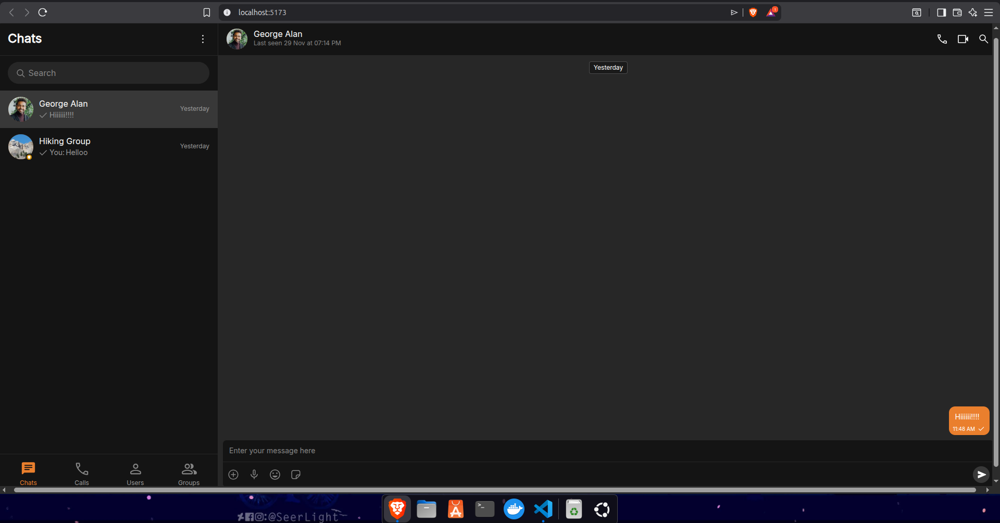

# CometChat Internship Evaluation – UI Kit Exploration & Issue Report

This repository contains my submission for the **CometChat Internship Evaluation Task**, where I explored the CometChat Dashboard, UI Kit Builder, documentation, and implemented the generated UI Kit in React.  
I have documented all issues, UX problems, friction points, and improvement suggestions in detail.

---

## 🚀 Project Overview

Using a CometChat app created with the required `+test` Gmail format, I:

1. Explored the **CometChat Dashboard**
2. Used the **UI Kit Builder** to configure & download a UI Kit
3. Implemented the UI Kit in **React**
4. Documented all issues, inconsistencies, and suggestions
5. Compiled a detailed PDF report (included in this repository)

---

## 🖥️ Tech Stack Used

- **React**
- Vite (optional)
- CometChat UI Kit
- JavaScript / TypeScript

---

## 📸 Screenshots / Demo

> **Add your actual images here after running the project**

### Dashboard Preview

### UI Kit Implementation

## 🎥 Demo Video

## 📝 Findings Summary

A detailed PDF is included, but here is a high-level summary:

### 🔹 Dashboard Issues

- Missing dark mode (expected modern apps to have this)
- Profile customization missing (users cannot change DP easily)
- Some navigation items felt unclear for first-time users

### 🔹 UI Kit Builder Issues

- Threaded replies open a new thread → reduces visibility in group chats  
  Users replying in both the main chat + thread may become confused.
- No option to select wallpaper/themes for individual chats
- No suggestions under the **Calls** section (e.g., suggested contact list)

### 🔹 Implementation Issues

- Some instructions reference using the "_entire downloaded folder_"  
  but the task instruction specifically says:  
  **Use only the UI Kit folder, not the whole downloaded package** → conflict.
- Minor missing dependencies and unclear documentation sections
- A few expected features didn’t match documentation exactly

---

## 📄 PDF Report

[Download the full PDF report](https://drive.google.com/file/d/1RP5thnoQzsH_OV-4DYfnGbKQQe_t4x9Z/view?usp=sharing)

<!-- Replace the path above with your PDF location (e.g., ./reports/report.pdf or https://example.com/report.pdf). -->
